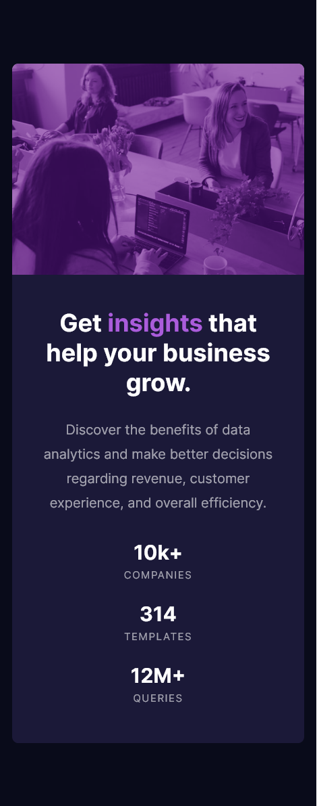

# Frontend Mentor - Stats preview card component solution

-   This is a solution to the [Stats preview card component challenge on Frontend Mentor](https://www.frontendmentor.io/challenges/stats-preview-card-component-8JqbgoU62).

## Table of contents

-   Screenshots
-   Links
-   My process
    -   Built with
    -   What I learned
    -   Continued development
    -   Useful resources
-   Author
-   Acknowledgments

### Screenshots

    - Mobile screen shot --> 
    - Desktop screen shot --> 

### Links

-   Solution URL: [Add solution URL here](https://your-solution-url.com)

## My process

-   I knew that I should use a mobile-first layout approach, and gradually change media queries based on viewport width to resize for the desktop size. I tried my best to follow the "outside working in" approach digging deeper into each child element and working with their respective box-models but, there were definitely some guesses regarding placement especially as it pertains to margins (which is why my css may look somewhat messy).
-   I took time to examine things very closely and tried to really copy the original card. Even though its not 100%, I feel like having a plan to know where to use what styles/fonts/colours/etc. is important before setting up the html, so thats what I did.

### Built with

-   Basic HTML5 markup (VSCode helps with a lot of setting up!)
-   CSS custom properties
-   Custom table of contents in the CSS to help organize code and aid navigation for all selectors
-   Basic grid set-up to center the stats card
-   Flexbox
-   Mobile-first approach
-   Background blend mode
-   Media queries
-   Letter spacing (which I've never used before!)

### What I learned

-   The most important thing I learned from this challenge is that I have a lot more to learn. Even though I thought I knew the "basics" about font/sizing/margins/etc. in CSS, I found very quickly how easy it is to forget those things.
-   This should have been a pretty simple challenge but, it took me a few days to do trying to get all the placements exactly right. If anything, it helped me reinforce the importance of looking at notes and doing extra research. It also helped me reinforce that its okay to forget things, even if I feel I "should already know them".
-   That being said, I'm happy with (most) of the following CSS code, mainly because it used some interesting properties like "background-blend-mode" and even "order", the latter of which was to re-arrange the ordering of flex items when the breakpoint for desktop size is reached.

```css
/* 2.2 deals with the image part of the preview card */
.main-image {
    flex: 1;
    min-height: 250px;
    /* Rounding the appropriate corners: */
    border-radius: 0.5em 0.5em 0 0;
    background-image: url(images/image-header-mobile.jpg);
    background-size: cover;
    background-repeat: no-repeat;
    /* I used this blend mode with a slightly varied accent color (as declared with other custom variables in the root class selector) as I thought this color matched a bit better: */
    background-blend-mode: soft-light;
    background-color: var(--accent-color-query);
}
@media (min-width: 1440px) {
    .main-image {
        /* Changing the appropriate corners: */
        border-radius: 0 0.5em 0.5em 0;
        /* Trying to make sure most of the image is "forced" into its part of the flexbox, hence the min-height is changed below: */
        flex: 1;
        /* Swapping the order of the flex items so that the image is on the right of the text when the breakpoint is hit: */
        order: 1;
        /* Also, making sure to change the source image to account for viewport changes: */
        background-image: url(images/image-header-desktop.jpg);
    }
}
```

### Continued development

-   I certainly need to continue working on concrete projects, and even refocus on the fundamentals of CSS.
-   I also think I need to explore grid more, as I feel this project could have been done with it just as easily as flexbox, but I avoided that as I'm not too familiar with grid.

### Useful resources

-   [The essential MDN for html elements](https://developer.mozilla.org/en-US/docs/Web/HTML/Element) was helpful for me to distinguish why elements should be appropriately classified, and not just have everything as a "div".
-   I also used a textbook as a resource, as I've been studying from it for a while now. Keith Grant's [CSS in Depth](https://www.manning.com/books/css-in-depth) is helping me through my web development studies, getting better and better at it each day thanks in large part to him!

## Author

-   Frontend Mentor: [@paul-mcj](https://www.frontendmentor.io/profile/paul-mcj)
-   Github: [paul-mcj](https://github.com/paul-mcj)

## Acknowledgments

I want to thank my best friend Alex! He helped reassure me that I know what I'm doing, lol!
